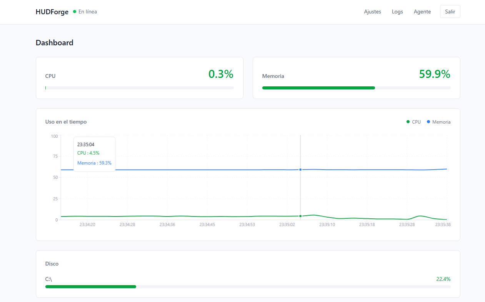
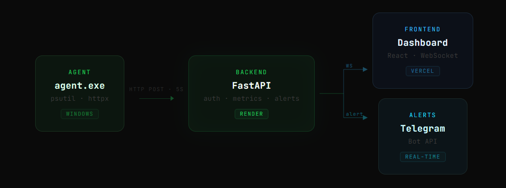
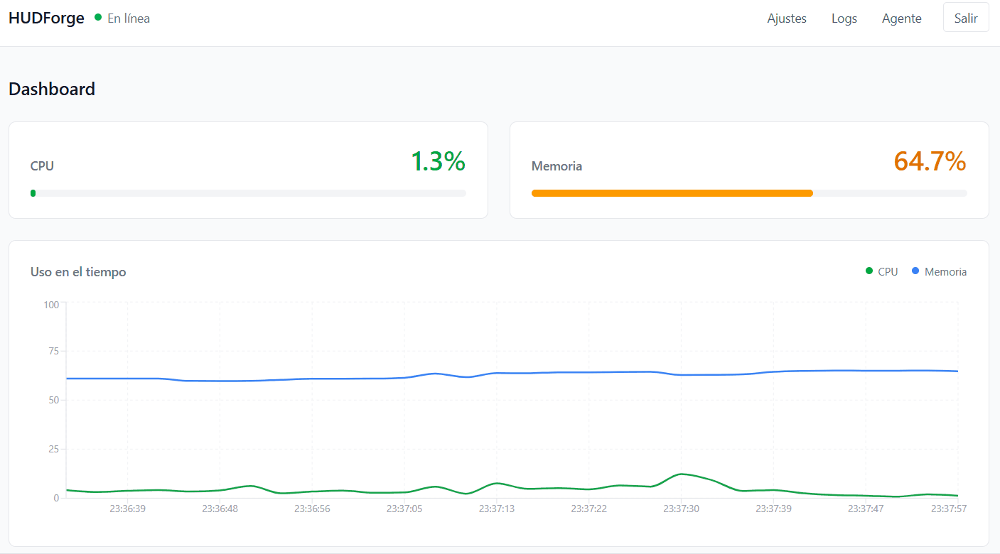

# HUDForge



HUDForge is a real-time system monitor built for developers who want visibility into their machines. It collects CPU, RAM, disk, and process data from a lightweight background agent, streams it live to a web dashboard, and sends alerts to Telegram when thresholds are exceeded.

Built as a portfolio project to demonstrate backend engineering and cybersecurity awareness.

---

## Live Demo

Frontend: https://hud-forge.vercel.app  
Backend API: https://hudforge.onrender.com/docs

---

## How it works



A Python agent runs silently in the background on your machine and sends system metrics to the backend every 5 seconds. The backend stores them in PostgreSQL, checks alert thresholds, and pushes the data in real time to the web dashboard via WebSockets. If a metric exceeds a configured limit, a Telegram message is sent immediately.

---

## Stack

Backend: Python, FastAPI, SQLAlchemy, Alembic  
Database: PostgreSQL on Supabase  
Auth: JWT with python-jose and bcrypt  
Agent: Python, psutil, httpx  
Frontend: React, Vite, Tailwind CSS, Recharts  
Realtime: WebSockets  
Alerts: Telegram Bot API  
Deploy: Render, Vercel, Supabase  
Packaging: PyInstaller

---

## Features

Real-time CPU, RAM and disk monitoring via WebSocket  
Multi-partition disk support  
Configurable alert thresholds per metric  
Telegram notifications when limits are exceeded  
JWT authentication with bcrypt password hashing  
Per-user settings and agent token  
Log history with pagination and type filtering  
Lightweight agent packaged as a Windows executable  
Silent background process with no visible window

---

## Getting started



### 1. Create an account

Go to https://hud-forge.vercel.app and register. After registration you will receive your agent token. Keep it, you will need it in the next step.

### 2. Download the agent

Go to the Agent page inside the dashboard and download the executable.

### 3. Run the agent

Double click `agent.exe`. On the first launch a window will appear asking for your agent token. Paste it and confirm. The agent will save your configuration to `C:\Users\<you>\AppData\Roaming\HUDForge\` and start running silently in the background. It will not appear again unless you delete the configuration folder.

To verify the agent is running, open Task Manager and look for `agent.exe` in the process list. You can also check the dashboard — metrics will start appearing within a few seconds.

### 4. Configure your alerts

Go to Settings inside the dashboard. Set your CPU, RAM and disk thresholds, and enter your Telegram bot token and chat ID to receive notifications.

---

## Project structure

```
HUDForge/
    agent/          Python agent that collects and sends metrics
    backend/        FastAPI backend with auth, metrics, alerts and logs
    frontend/       React dashboard with real-time WebSocket updates
```

---

## Local development

### Backend

```
cd backend
python -m venv venv
venv\Scripts\activate
pip install -r requirements.txt
uvicorn main:app --reload
```

Create a `.env` file in the backend folder:

```
DATABASE_URL=your_supabase_connection_string
SECRET_KEY=your_secret_key
ALGORITHM=HS256
ACCESS_TOKEN_EXPIRE_MINUTES=30
```

Generate a secure secret key with:

```
python -c "import secrets; print(secrets.token_hex(32))"
```

### Agent

```
cd agent
python -m venv venv
venv\Scripts\activate
pip install -r requirements.txt
python main.py
```

### Frontend

```
cd frontend
npm install
npm run dev
```

---

## Roadmap

Process blacklist alerts to detect suspicious activity  
Mobile-friendly dashboard  
Historical metric charts with date range selection  
Linux and macOS agent support

---

## Author

Mihai Sebastian Burghelea  
https://github.com/msburghelea